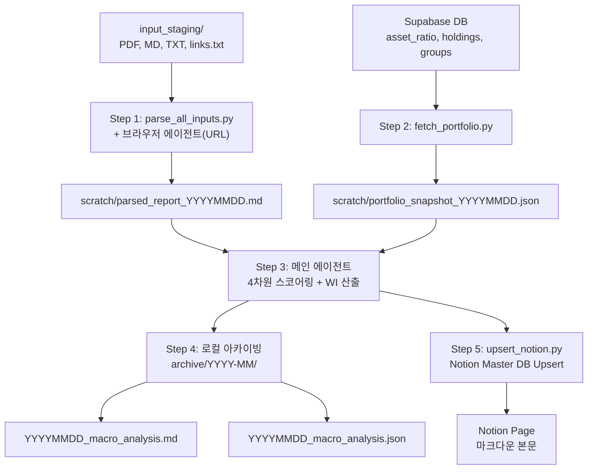

# Macro-Portfolio Cross-Analyzer — 구현 계획서

글로벌 매크로 경제 분석 에이전트를 구축합니다. 매일 수집되는 매크로 리포트/뉴스를 파싱하고, Supabase의 포트폴리오 데이터와 교차 분석하여 4차원 정량 스코어(Direction, Horizon, Signal, Impact)를 산출하고, Weighted Impact를 통해 개인화된 투자 인사이트를 도출합니다.

> [!IMPORTANT]
> 이 계획은 `/grill-me` 인터뷰를 통해 확정된 14개 설계 결정을 기반으로 합니다.

## 확정된 설계 결정

| # | 항목 | 결정 |
|---|------|------|
| 1 | 스크립트 언어 | **Python** (Antigravity SDK 호환 고려) |
| 2 | 파일 형식 | **PDF + MD + TXT** |
| 3 | URL 크롤링 | **브라우저 에이전트** (read_browser_page) |
| 4 | 스코어링 | **4차원** + Weighted Impact 공식 |
| 5 | 리포트 구조 | **Part A~E** |
| 6 | Notion 적재 | **본문 마크다운** (DB 속성 미사용) |
| 7 | Notion 방식 | **Hybrid** (Upsert→스크립트, 본문→에이전트) |
| 8 | 패키지 관리 | **pyproject.toml + uv** |
| 9 | 디렉토리 | 지침서 `.agents/` 구조 |
| 10 | 시크릿 | **.env + dotenv** |
| 11 | 우선순위 | **Step 1~4 우선**, Step 5 후속 |
| 12 | 검증 | 샘플 데이터 E2E 테스트 |

---

## Proposed Changes

### 1. 프로젝트 기반 구조

#### [NEW] [pyproject.toml](file:///c:/Users/infomax/Documents/macro_analyzer/macro_analyzer/pyproject.toml)
- Python 프로젝트 메타데이터 및 의존성 정의
- 주요 의존성: `pdfplumber`, `supabase`, `notion-client`, `python-dotenv`, `httpx`

#### [NEW] [.env.example](file:///c:/Users/infomax/Documents/macro_analyzer/macro_analyzer/.env.example)
- `SUPABASE_URL`, `SUPABASE_KEY`, `NOTION_API_KEY`, `NOTION_DB_ID` 환경변수 템플릿

#### [MODIFY] [.gitignore](file:///c:/Users/infomax/Documents/macro_analyzer/macro_analyzer/.gitignore)
- `.env`, `scratch/`, `__pycache__/`, `.venv/` 등 추가

#### [NEW] 디렉토리 생성
```
input_staging/          # .gitkeep 포함
scratch/                # .gitkeep 포함
archive/                # .gitkeep 포함
```

---

### 2. 에이전트 설정 (AGENTS.md + SKILL)

#### [NEW] [AGENTS.md](file:///c:/Users/infomax/Documents/macro_analyzer/macro_analyzer/AGENTS.md)
- 글로벌 에이전트 페르소나: 매크로 경제 분석가 + TAA 포트폴리오 관리자
- 4차원 스코어링 공식 정의:
  - **Direction**: [-1.0, -0.5, 0.0, +0.5, +1.0]
  - **Horizon**: [1(단기), 2(중기), 3(장기)]
  - **Signal**: [0.0 ~ 1.0]
  - **Impact**: [0.0 ~ 1.0]
  - **Weighted Impact** = Direction × Signal × Impact × 포트폴리오_비중(%)
- 핵심 룰: 모호한 Direction은 0.0(중립) 강제, JSON은 Strict 포맷

#### [NEW] [.agents/skills/macro_portfolio_analysis/SKILL.md](file:///c:/Users/infomax/Documents/macro_analyzer/macro_analyzer/.agents/skills/macro_portfolio_analysis/SKILL.md)
- Step 1~5 워크플로우 상세 지침
- Part A~E 출력 서식 정의:
  - **Part A**: 매크로 요약 (핵심 이슈 3~5개, 시장 센티먼트)
  - **Part B**: 교차 스코어링 테이블 (이슈 × 자산분류 매핑 + 4차원 스코어)
  - **Part C**: Re-aggregate 집계 (자산분류별 WI 합산 TOP 5 + 종합 점수)
  - **Part D**: 액션 플랜 (비중 조정/리밸런싱/신규 편입 제안)
  - **Part E**: 리스크 요인 + 모니터링 포인트

#### [NEW] [.agents/skills/macro_portfolio_analysis/references/asset_classification.md](file:///c:/Users/infomax/Documents/macro_analyzer/macro_analyzer/.agents/skills/macro_portfolio_analysis/references/asset_classification.md)
- Supabase `groups` 테이블 기반 3단계 자산분류 체계 정적 문서
- 자산군(주식/채권/대체자산/현금성) → 세부자산군 → 세부자산군2 매핑

---

### 3. Python 스크립트 (결정론적 작업)

#### [NEW] [src/scripts/parse_all_inputs.py](file:///c:/Users/infomax/Documents/macro_analyzer/macro_analyzer/src/scripts/parse_all_inputs.py)
- **역할**: `input_staging/` 내 모든 로컬 파일(PDF/MD/TXT) 파싱 → 병합
- **로직**:
  1. `input_staging/` 디렉토리 스캔
  2. PDF: `pdfplumber`로 텍스트 추출
  3. MD/TXT: 직접 읽기
  4. 모든 텍스트를 `scratch/parsed_report_YYYYMMDD.md`로 병합
- **예외**: 파싱 실패 시 에러 로깅 + Skip & Continue
- **Note**: `links.txt` URL 크롤링은 메인 에이전트가 브라우저 에이전트를 호출하여 처리 후, 결과를 이 파일에 append

#### [NEW] [src/scripts/fetch_portfolio.py](file:///c:/Users/infomax/Documents/macro_analyzer/macro_analyzer/src/scripts/fetch_portfolio.py)
- **역할**: Supabase에서 포트폴리오 스냅샷 조회
- **로직**:
  1. `asset_ratio` 테이블: 자산군별 평가금액/비중
  2. `holdings` 테이블: 개별 상품 보유현황
  3. `groups` 테이블: 정렬순서
  4. 결과를 `scratch/portfolio_snapshot_YYYYMMDD.json`으로 저장
- **예외**: 3회 재시도(Retry) → 최종 실패 시 빈 배열 + 에러 상태 반환

#### [NEW] [src/scripts/upsert_notion.py](file:///c:/Users/infomax/Documents/macro_analyzer/macro_analyzer/src/scripts/upsert_notion.py)
- **역할**: Notion Master DB에 당일 분석 결과 Upsert
- **로직**:
  1. Master DB에서 당일(YYYY-MM-DD) 날짜 페이지 쿼리
  2. 존재하면 기존 블록 삭제 후 새 블록으로 Update
  3. 없으면 새 페이지 Create
  4. 에이전트가 생성한 마크다운 본문을 Notion 블록으로 변환하여 적재
- **예외**: Rate Limit(429) 시 지수 백오프 재시도
- **Note**: 구현만. Notion 통합 공유 후 테스트 예정

#### [NEW] [src/scripts/\_\_init\_\_.py](file:///c:/Users/infomax/Documents/macro_analyzer/macro_analyzer/src/scripts/__init__.py)
#### [NEW] [src/\_\_init\_\_.py](file:///c:/Users/infomax/Documents/macro_analyzer/macro_analyzer/src/__init__.py)

---

### 4. 샘플 테스트 데이터

#### [NEW] input_staging/ 테스트 파일들
- `sample_macro_report.md` — 샘플 매크로 분석 리포트 (미국 금리/인플레이션/고용 등)
- `sample_news.txt` — 당일 매크로 뉴스 요약
- `links.txt` — 테스트용 URL 1~2개

---

## 4차원 스코어링 체계 상세

### 스코어 정의

| 차원 | 범위 | 설명 |
|------|------|------|
| **Direction** | [-1.0, -0.5, 0.0, +0.5, +1.0] | 해당 자산군에 대한 방향성. +는 강세, -는 약세 |
| **Horizon** | [1, 2, 3] | 1=단기(1주~1개월), 2=중기(1~6개월), 3=장기(6개월+) |
| **Signal** | [0.0 ~ 1.0] (0.1 단위) | 신호의 신뢰도. 복수 소스 일치=높음, 단일 소스/모호=낮음 |
| **Impact** | [0.0 ~ 1.0] (0.1 단위) | 해당 자산군에 대한 영향 강도. 직접적=높음, 간접적=낮음 |

### Weighted Impact 공식

```
WI(i,j) = Direction(i,j) × Signal(i,j) × Impact(i,j) × Weight(j)
```
- `i` = 매크로 이슈, `j` = 자산분류(세부자산군2 레벨)
- `Weight(j)` = `asset_ratio` 테이블의 비중(%)

### Re-aggregate 집계
```
Total_WI(j) = Σ WI(i,j)   (모든 매크로 이슈 i에 대해 합산)
Portfolio_Score = Σ Total_WI(j)   (모든 자산분류 j에 대해 합산)
```

### 모호성 처리 규칙
- Direction을 명확히 도출할 수 없으면 → **0.0 (중립)** 강제
- Signal/Impact를 판단할 근거가 부족하면 → **0.3** (보수적 기본값)

---

## 데이터 흐름도



---

## Verification Plan

### 자동 검증
1. `parse_all_inputs.py` 단독 실행 → `scratch/parsed_report_*.md` 생성 확인
2. `fetch_portfolio.py` 단독 실행 → `scratch/portfolio_snapshot_*.json` 생성 + Supabase 데이터 정합성 확인
3. 전체 파이프라인 E2E: 샘플 데이터로 Step 1~4 실행 → `archive/` 에 MD/JSON 산출물 생성 확인

### 수동 검증
- `archive/` 산출물의 Part A~E 내용 및 스코어링 값 검토
- Notion 적재는 통합 공유 후 별도 테스트
